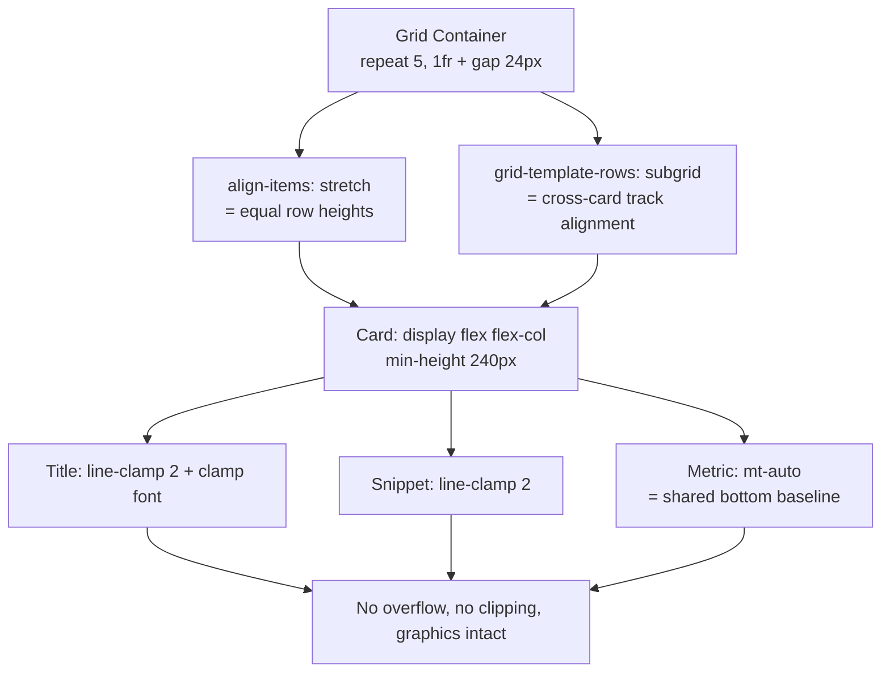

# Card Sizing & Internal Alignment — Implementation Plan
### Wix Web Trends Tracker — Dashboard Grid

> **Goal:** Ensure all cards in the grid have the same size and internal alignment without breaking graphics, items, or text.

---

## 1. Problem Statement

The current spec relies on a **fixed-height hack**:

```jsx
className="... rounded-3xl p-6 h-[240px]"  // ❌ fragile
```

Per 2026 best practices, fixed heights are fragile and break when content changes:

- Longer titles (e.g., German/RTL translations) overflow or get clipped
- Users with larger default font sizes break the layout
- Sparkline charts or longer snippets get pushed out of the box
- Layouts that only "work" because of `overflow: hidden` are inherently unstable

`line-clamp-2` partially mitigates this, but relying on clamping to force-fit content signals the layout needs restructuring.

---

## 2. Solution Overview — 3-Layer Approach

| Layer | Responsibility | Technique |
|-------|---------------|-----------|
| **1. Grid** | Equal column width + equal row height | `grid-template-columns: repeat(5, 1fr)` + `align-items: stretch` |
| **2. Flexbox** | Internal alignment (pin metric to bottom) | `display: flex; flex-direction: column;` + `mt-auto` |
| **3. Subgrid** | Pixel-perfect cross-card track alignment | `grid-template-rows: subgrid` |

---

## 3. Implementation Steps

### Step 1 — Grid sets the structure

```css
.dashboard-grid {
  display: grid;
  grid-template-columns: repeat(5, 1fr); /* desktop: 5 cols */
  gap: 24px;
  align-items: stretch; /* default — equalizes height per row */
}
```

- `align-items: stretch` makes every card in a row grow to match the tallest card (no JS, no fixed heights).
- `1fr` columns guarantee identical widths across the row.

---

### Step 2 — Flexbox handles internal alignment (key fix)

```jsx
<motion.div
  layoutId={`widget-${trend._id}`}
  className="cursor-pointer flex flex-col bg-white/60 dark:bg-black/60
             backdrop-blur-xl border border-white/20 shadow-sm
             rounded-3xl p-6 min-h-[240px]"   // ✅ min-height, not fixed
>
  {/* Top row: badge + date */}
  <div className="flex justify-between items-start">
    <span className="text-xs font-bold uppercase text-blue-500">{trend.category[0]}</span>
    <time className="text-xs text-gray-400">{trend.date}</time>
  </div>

  {/* Title — clamp INTENTIONALLY (2 lines max per spec) */}
  <h3 className="mt-2 text-xl font-bold font-wix-madefor line-clamp-2">{trend.title}</h3>

  {/* Snippet */}
  <p className="mt-2 text-sm text-gray-600 dark:text-gray-300 line-clamp-2">{trend.snippet}</p>

  {/* Metric — mt-auto pushes it to bottom, aligning ALL cards' metrics */}
  <div className="mt-auto flex items-center gap-2">
    <span className="text-2xl font-bold">{trend.metricValue}%</span>
  </div>
</motion.div>
```

**Critical change:** `flex flex-col` + `mt-auto` on the metric block ensures the trend indicator/sparkline sits on a **shared baseline across every card**, even when titles wrap differently. This is the single most important fix for consistent internal alignment.

---

### Step 3 — CSS Subgrid for perfect cross-card alignment (2026 best practice)

Universally supported: Chrome/Edge 117+, Firefox 71+, Safari 16+ (no fallback needed).

```css
.dashboard-grid {
  display: grid;
  grid-template-columns: repeat(5, 1fr);
  grid-auto-rows: auto; /* shared row tracks */
  gap: 24px;
}

.card {
  display: grid;
  grid-template-rows: subgrid;   /* ✅ inherits parent's row tracks */
  grid-row: span 4;              /* badge / title / snippet / metric = 4 rows */
}
```

This lets every card's title occupy the **same row track** as its neighbors — so a 2-line title aligns with a 1-line title. Subgrid eliminates the need for `min-height` and clamping-as-a-crutch.

> ⚠️ **Subgrid pitfall:** Do **not** put `padding` on the subgrid container — it shifts the tracks and breaks alignment. Apply padding to the individual inner items instead.

---

## 4. Protecting Text & Graphics From Breaking

| Element | Technique | Why |
|---------|-----------|-----|
| **Title** | `line-clamp: 2` + fluid font `clamp(1rem, 1.5vw, 1.25rem)` | Prevents overflow from long titles/translations |
| **Snippet** | `line-clamp: 2` | Enforces visual ceiling (spec truncates to 150 chars) |
| **Sparkline/Metric** | Wrap in `flex-shrink-0` + reserve fixed row track | Stops chart from being squashed or pushed out |
| **Badge** | `flex-shrink-0` pill | Keeps category pill from wrapping/distorting |
| **Glass container** | `overflow: hidden` on `border-radius: 24px` only | Keeps squircle clean without hiding meaningful content |

---

## 5. Reconciling With the "3.5 Rows Visible" Requirement

The spec wants exactly **3.5 rows above the fold** for visual tension, which depends on a predictable card height. Resolution:

- Use `min-height: 240px` (not `height`) so cards never shrink below target, preserving the 3.5-row math.
- Combined with `line-clamp` (title 2 lines + snippet 2 lines), the *maximum* content height is also bounded.
- Result: cards settle at ~240px in the common case (satisfies fold math) but grow gracefully when needed instead of clipping.

```jsx
// Sweet spot for this spec:
className="flex flex-col min-h-[240px] ..."  // floor for fold math, no hard ceiling
```

---

## 6. Architecture Diagram



---

## 7. Task Checklist

- [ ] Replace `h-[240px]` with `min-h-[240px]` on card container
- [ ] Add `flex flex-col` to card container
- [ ] Add `mt-auto` to the metric/sparkline block
- [ ] Confirm `align-items: stretch` on grid (default — verify not overridden)
- [ ] Implement subgrid (`grid-template-rows: subgrid`, `grid-row: span 4`)
- [ ] Move padding from subgrid container to inner items
- [ ] Apply fluid `clamp()` typography to title
- [ ] Add `flex-shrink-0` to badge and metric/sparkline
- [ ] Verify 3.5-row fold math still holds at 1080p
- [ ] Test with long titles, translations, and increased font sizes
- [ ] Cross-browser test (Chrome, Edge, Firefox, Safari)

---

## 8. Key Takeaways

1. **Replace `h-[240px]` with `min-h-[240px]`** + `flex flex-col` — biggest single fix.
2. **`mt-auto` on the metric block** guarantees same internal alignment across cards.
3. **`align-items: stretch`** (grid default) equalizes height per row automatically.
4. **CSS Subgrid** is the 2026 best-practice for perfect cross-card track alignment.
5. **`line-clamp` + fluid `clamp()` typography** protect text without making the layout fragile.
6. **Never put padding on a subgrid container** — apply it to inner items.
